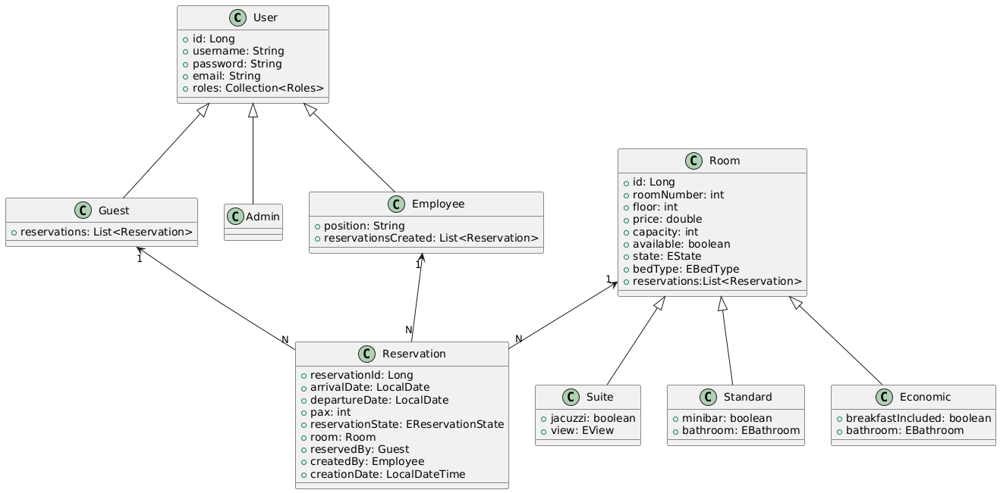

# **IronHotel - Sistema de Reservas Hotelero  🏨**

## **📌 Descripción del Proyecto**

IronHotel es una aplicación web diseñada para la **gestión de reservas hoteleras** de forma simplificada para la presentación del proyecto 1 del curso JAVA BACKEND de IRONHACK y OPENBANK. Esta aplicación permite a los huéspedes reservar habitaciones, a los empleados administrar reservas, y a los administradores gestionar los usuarios del sistema.
---

## 📚 Class Diagram




---

## ⚙️ Setup

1. Clona el repositorio:
```bash
git clone https://github.com/anruiz-r/IronHotel.git
cd IronHotel
```

2. Configura tu base de datos MySQL y actualiza `application.properties`:
```properties
spring.application.name=ironhotel
spring.datasource.url=jdbc:mysql://localhost:3306/ironhotel
spring.datasource.username=root
spring.datasource.password=admin
spring.datasource.driver-class-name=com.mysql.cj.jdbc.Driver
spring.jpa.hibernate.ddl-auto=update
spring.jpa.database-platform=org.hibernate.dialect.MySQLDialect
server.port=8080

```
3. Ejecuta la aplicación con tu IDE preferido o cualquier otro método de tu elección.

---

## 💻 Technologies Used

- Java 21
- Spring Boot
- Spring Web
- Spring Data JPA
- MySQL
- Lombok
- Maven
- Postman (testing)
- JUnit (testing)
- Mockito (testing)

---

## 🧭 Controllers and Routes Structure

| Method                 | Endpoint                                             | Description                                          |
| ---------------------- | ---------------------------------------------------- | ---------------------------------------------------- |
| **AUTH**               |                                                      |                                                      |
| POST                   | `/api/public/auth/login`                             | Iniciar sesión                                       |
| POST                   | `/api/public/auth/signup`                            | Crear nuevo usuario                                  |
| GET                    | `/api/public/auth`                                   | Listar todos los usuarios                            |
| DELETE                 | `/api/public/auth/{id}`                              | Eliminar usuario por ID                              |
| **ROOMS - ECONOMIC**   |                                                      |                                                      |
| POST                   | `/api/public/rooms/economics`                        | Crear habitación económica                           |
| PUT                    | `/api/public/rooms/economics/{roomId}`               | Actualizar habitación económica por ID               |
| GET                    | `/api/public/rooms/economics`                        | Listar todas las habitaciones económicas             |
| GET                    | `/api/public/rooms/economics/withBreakfastIncluded`  | Listar habitaciones económicas con desayuno incluido |
| **ROOMS - STANDARD**   |                                                      |                                                      |
| POST                   | `/api/public/rooms/standards`                        | Crear habitación estándar                            |
| PUT                    | `/api/public/rooms/standards/{roomId}`               | Actualizar habitación estándar                       |
| GET                    | `/api/public/rooms/standards`                        | Listar todas las habitaciones estándar               |
| **ROOMS - SUITE**      |                                                      |                                                      |
| POST                   | `/api/public/rooms/suites`                           | Crear habitación suite                               |
| PUT                    | `/api/public/rooms/suites/{roomId}`                  | Actualizar habitación suite                          |
| GET                    | `/api/public/rooms/suites`                           | Listar todas las habitaciones suite                  |
| **ROOMS - GENERAL**    |                                                      |                                                      |
| GET                    | `/api/public/rooms`                                  | Listar todas las habitaciones                        |
| GET                    | `/api/public/rooms/bed-type/{bedType}`               | Buscar habitaciones por tipo de cama                 |
| GET                    | `/api/public/rooms/available-rooms`                  | Listar habitaciones disponibles                      |
| DELETE                 | `/api/public/rooms/{roomId}`                         | Eliminar habitación por ID                           |
| **EMPLOYEES & GUESTS** |                                                      |                                                      |
| POST                   | `/api/public/employees`                              | Crear empleado                                       |
| POST                   | `/api/public/guests`                                 | Crear huésped                                        |
| **RESERVATIONS**       |                                                      |                                                      |
| POST                   | `/api/public/reservations`                           | Crear reserva (solo si hay disponibilidad)           |
| PATCH                  | `/api/public/reservations/{reservationId}`           | Modificar una reserva                                |
| PATCH                  | `/api/public/reservations/cancel/{reservationId}`    | Cancelar una reserva                                 |
| DELETE                 | `/api/public/reservations/{reservationId}`           | Eliminar una reserva                                 |
| GET                    | `/api/public/reservations`                           | Listar todas las reservas                            |
| GET                    | `/api/public/reservations/{reservationId}`           | Obtener una reserva por ID                           |
| GET                    | `/api/public/reservations/arrival/{arrivalDate}`     | Buscar reservas por fecha de llegada                 |
| GET                    | `/api/public/reservations/departure/{departureDate}` | Buscar reservas por fecha de salida                  |
| GET                    | `/api/public/reservations/{state}`                   | Buscar reservas por estado                           |
| **OTHERS**             |                                                      |                                                      |
| GET                    | `/api/public/hello`                                  | Ruta de prueba (respuesta: "Hola postman")           |

---

## 🔗 Extra Links

- 📌 [Trello Board](https://trello.com/b/CBEI8Qc5/project1)
- 🎤 [Presentation Slides](https://www.canva.com/design/DAGnU3G9gAk/xpXPNnJSJ6cQ8cX80CXaEw/edit?utm_content=DAGnU3G9gAk&utm_campaign=designshare&utm_medium=link2&utm_source=sharebutton)
- 📫 [Postman Collection](https://craftshop.postman.co/workspace/My-Workspace~64247626-9b1b-40cf-82e4-df164e396f63/collection/39061244-5ccde0dc-49f7-424a-a40d-19eb2b697f9b?action=share&creator=39061244)

---

## 🔮 Future Work

Posibles mejoras que podrían llevarse a cabo con más tiempo:
- Implementar correctamente Spring Security con JWT y roles (admin, user), ya que ahora no termina de funcionar.
- Validaciones más robustas (por ejemplo, que `arrivalDate < departureDate`) y excepciones personalizadas.
- Posible integración de entidades de pago
- Hacer posible la funcionalidad de check-in /check-out

---

## 📚 Resources

- [Documentación oficial de Spring Boot](https://spring.io/projects/spring-boot)
- [Guía de Lombok](https://projectlombok.org/)
- [MySQL Docs](https://dev.mysql.com/doc/)
- [Baeldung Spring Tutorials](https://www.baeldung.com/)

---

## 👥 Team Members

- 👩‍💻 Ángela Ruiz Rodríguez– Full Stack Developer – [@githubUser](https://github.com/anruiz-r)
